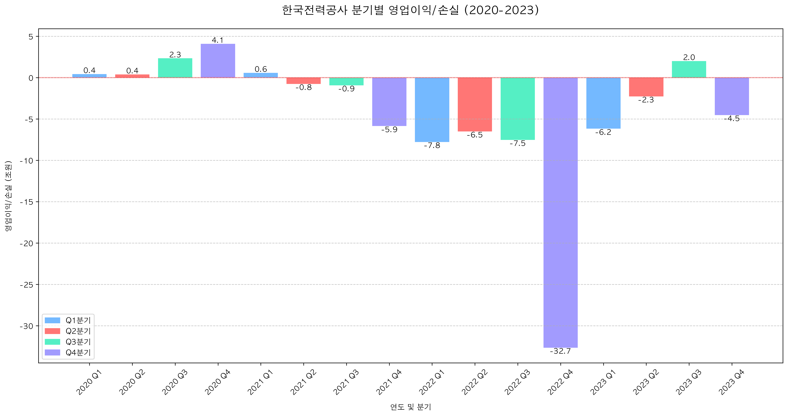
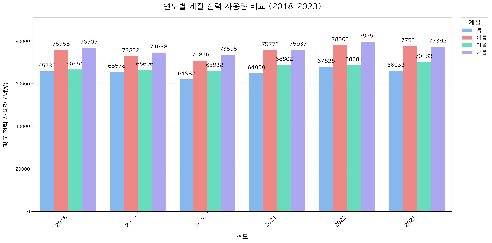
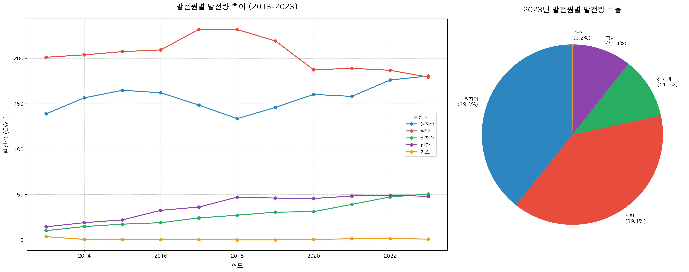
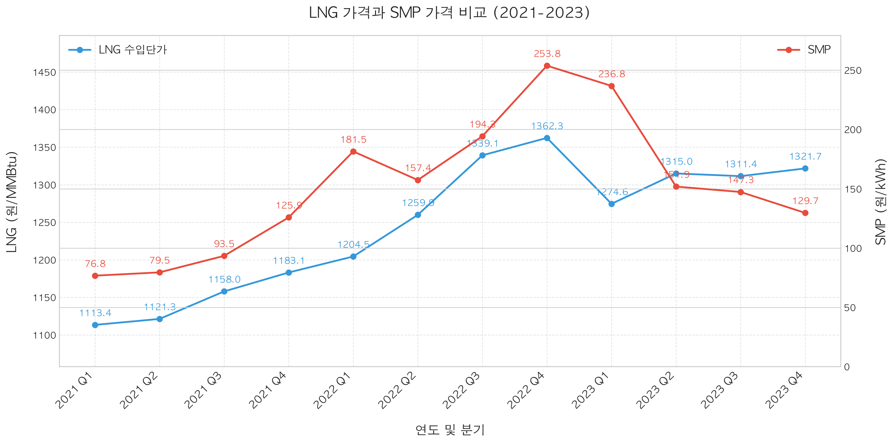

# 한국전력공사 적자 원인분석

## 1. 분석 배경 및 목적

> "한전, 작년 5.8조 역대최대 적자…" - 2022.02.25, 동아일보  
> "‘145兆 빚더미’ 한전… 올 20兆 적자폭탄 터지나" - 2022.03.30, 대한경제  
> "한전 상반기까지 46조9516억원 누적적자" - 2023.08.14, 이투뉴스

최근 주요 보도를 통해 한전의 대규모 적자 사태를 접하며 재무 위기의 심각성을 접하게되었습니다.   
이에 실제 데이터를 바탕으로 적자의 구조적 원인을 파헤쳐 보고자 본 주제를 선정하였습니다.  

## 2. 한전 영업실적 
 한국전력공사의 적자 현황을 정확히 파악하기 위해, 최근 4년간의 영업손익 추이를 시각화해보았습니다.  
시각화된 자료를 기반으로 분석해본 결과, 2021년부터 적자가 발생하기 시작했으며, 2022년 2-3분기에 적자 규모가 급격히 증가한 사실을 알 수 있었습니다.   

## 3. 국내 전력 시장 특징
데이터 분석 하기전 도메인 관련한 지식을 정리할 필요를 느껴 국내 전력시장 정보를 정리해보았습니다.
### 전력 거래 시장 벨류체인
 국내 전력거래 시장은 발전사, 전력거래소, 송배전망사업자, 소매판매사업자, 소비자 등 다양한 주체가 참여하는 구조로 되어 있습니다.  
전력거래소는 전력을 거래하는 플랫폼으로, 발전사들이 생산한 전력을 판매하고 한전이 이를 구매하는 방식(도매)으로 운영됩니다. 이후 한전은 이를 소비자에게 판매(소매)하는 형태로 이루어져 있습니다.  
이러한 시장의 밸류체인 구조는 강제적 풀(pool) 시스템으로 모든 전력거래는 전력거래소를 통해 이루어져야 하며, 비용기반 전력시장(Cost Based Pool, CBP)으로 발전비용을 기반으로 전력거래가 이루어집니다.  
또한 위에서 언급한 것과 같이 단일 구매자 시스템으로 한전이 유일한 구매자로서 모든 전력을 구매합니다.  

### 가격 결정 메커니즘
 국내 전력시장의 가격 결정은 계통한계가격(SMP)을 통해 이루어집니다. SMP는 시간대별 예측수요를 충족시키기 위해 가동되는 발전기 중 가장 비용이 높은 발전기의 변동비로 결정됩니다.  
일반적으로 LNG 발전이 SMP를 결정하는 경우가 많으며, 2021년에는 전체 시간의 약 90%를 LNG 발전이 SMP를 결정했습니다 
또한 특정 발전원의 초과이윤을 조정하기 위해 정산조정계수가 도입되어 있으며, 이는 발전차익에 곱해져 최종 정산금액을 조정합니다.  
하지만 `LNG 발전의 경우 이 정산조정계수가 적용되지 않습니다.`

## 4. 국내 전력 수요의 특징
 우리나라의 전력 수요의 특징을 파악하기 위해, 2018~2022 계절별 수요량을 시각화해보았습니다.  
시각화된 자료를 통해 우리나라는 여름과 겨울에 수요랑이 봄,가을 대비 수요량이 높게 나타나는 사실을 알수 있었습니다.

## 5. 가설
전제: SMP가격이 오르면 한전의 적자 폭이 커진다.
여름과 겨울에 첨두부하가 발생한다.
첨두부하는 LNG 발전으로 해결한다.
LNG발전 가격은 곧 SMP 가격이다.

LNG 가격이 오르면 SMP가격이 올라 한전 적자폭이 커질것이다.

## 6. 증명

## 4. LNG 발전의 역할 분석
계절적인 전기 수요 증가에 대응하기 위해 LNG 연료를 활용한 첨두 부하 해결이 중요한 방식으로 사용된다. 이에 따라 우리나라에서 LNG 발전이 차지하는 비중과 역할을 파악하기 위해 발전원별 구성을 분석했다.

분석 결과, 2023년 기준 전체 발전량에서 LNG가 30%를 차지하고 있다. 이처럼 높은 LNG 발전 비중은 연료 가격 변동이 전력 시장에 직접적인 영향을 미칠 수 있는 구조임을 뜻한다.

## 5. LNG 발전과 SMP 관계 분석

LNG 발전의 비중이 높은 상황에서, LNG 가격과 전력시장가격(SMP)의 관계를 분석했다.

분석 결과, LNG 가격과 SMP는 매우 높은 상관관계를 보였다. 특히 2021년부터 시작된 국제 LNG 가격의 급격한 상승이 SMP의 가파른 상승으로 이어졌으며, 이는 한전의 전력 구매 비용 증가로 직결되었다.

## 6. 결론

데이터 분석 결과, 한전의 대규모 적자는 크게 두 가지 구조적 요인이 결합된 결과로 나타났다:

1. 전력 수요의 계절성으로 인한 LNG 의존도
  - 여름과 겨울철에 집중되는 냉난방 수요
  - 첨두부하 대응을 위한 LNG 발전의 불가피성
  - 높은 민간발전 비중으로 인한 LNG 가격 변동의 직접적 영향

2. 전기요금 조정의 경직성
  - 연료비 상승을 전기요금에 즉각 반영하지 못하는 요금 체계
  - 물가 안정을 위한 요금 인상 억제 정책
  - 한전의 적자 폭 확대로 이어지는 구조

이러한 구조적 요인들은 서로 맞물려 있어, 어느 한 부분만의 개선으로는 문제 해결이 어려울 것으로 판단된다. 장기적으로는 첨두부하 저감을 위한 수요관리와 함께, 탄력적인 요금 체계 도입에 대한 검토가 필요할 것으로 보인다.
