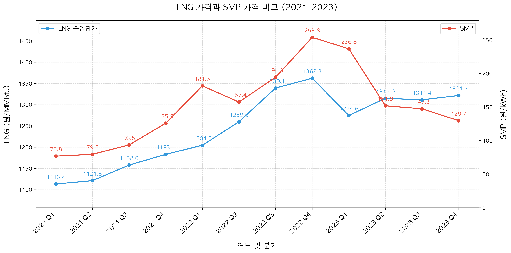

# 한국전력공사 적자 원인의 구조적 분석

## 1. 분석 배경 및 목적

> "한전, 작년 5.8조 역대최대 적자…" - 2022.02.25, 동아일보  
> "‘145兆 빚더미’ 한전… 올 20兆 적자폭탄 터지나" - 2022.03.30, 대한경제  
> "한전 상반기까지 46조9516억원 누적적자" - 2023.08.14, 이투뉴스

한국전력공사(이하 한전)의 대규모 적자에 대한 언론 보도가 이어지면서, 적자의 구조적 원인을 파악하기 위한 데이터 분석을 실시했다. 특히 적자의 시기적 특성과 전력 시장의 구조적 요인 간의 관계를 중심으로 분석을 진행했다.

## 2. 한전 영업실적 분석

한전의 적자가 특정 시기에 집중되어 있는지 확인하기 위해 최근 3년간의 분기별 영업실적을 분석했다.

데이터 분석 결과, 2021년부터 적자가 발생하기 시작했으며, 특히 2022년 2-3분기에 적자 규모가 급격히 증가한 것으로 나타났다. 이러한 계절적 편중 현상의 원인을 파악하기 위해 우리나라의 전력 수요 특성을 분석할 필요가 있었다.

## 3. 전력 수요 특성 분석

계절별 전력 수요를 분석한 결과, 우리나라는 뚜렷한 계절성을 보였다.

여름과 겨울철 전력 수요가 다른 계절 대비 20-30% 높게 나타났다. 이러한 급격한 수요 증가는 냉방과 난방 수요에 기인하며, 앞서 확인한 한전 적자의 계절적 집중과 동일한 패턴을 보였다. 이와 같은 계절성 높은 전력 수요에 대응하기 위해서는 탄력적인 발전원이 필요한데, 우리나라는 이를 LNG 발전으로 해결하고 있다.

## 4. LNG 발전의 역할 분석

우리나라 전력 생산에서 LNG 발전이 차지하는 비중과 역할을 파악하기 위해 발전원별 구성을 분석했다.

분석 결과, 2023년 기준 전체 발전량에서 LNG가 30%를 차지하고 있으며, 전체 전력구입량 중 민간발전사 비중은 32.2%를 기록했다. 이처럼 높은 LNG 발전 비중은 연료 가격 변동이 전력 시장에 직접적인 영향을 미칠 수 있는 구조임을 뜻한다.

## 5. LNG 발전과 SMP 관계 분석

LNG 발전의 비중이 높은 상황에서, LNG 가격과 전력시장가격(SMP)의 관계를 분석했다.

분석 결과, LNG 가격과 SMP는 매우 높은 상관관계를 보였다. 특히 2021년부터 시작된 국제 LNG 가격의 급격한 상승이 SMP의 가파른 상승으로 이어졌으며, 이는 한전의 전력 구매 비용 증가로 직결되었다.

## 6. 결론

데이터 분석 결과, 한전의 대규모 적자는 크게 두 가지 구조적 요인이 결합된 결과로 나타났다:

1. 전력 수요의 계절성으로 인한 LNG 의존도
  - 여름과 겨울철에 집중되는 냉난방 수요
  - 첨두부하 대응을 위한 LNG 발전의 불가피성
  - 높은 민간발전 비중으로 인한 LNG 가격 변동의 직접적 영향

2. 전기요금 조정의 경직성
  - 연료비 상승을 전기요금에 즉각 반영하지 못하는 요금 체계
  - 물가 안정을 위한 요금 인상 억제 정책
  - 한전의 적자 폭 확대로 이어지는 구조

이러한 구조적 요인들은 서로 맞물려 있어, 어느 한 부분만의 개선으로는 문제 해결이 어려울 것으로 판단된다. 장기적으로는 첨두부하 저감을 위한 수요관리와 함께, 탄력적인 요금 체계 도입에 대한 검토가 필요할 것으로 보인다.